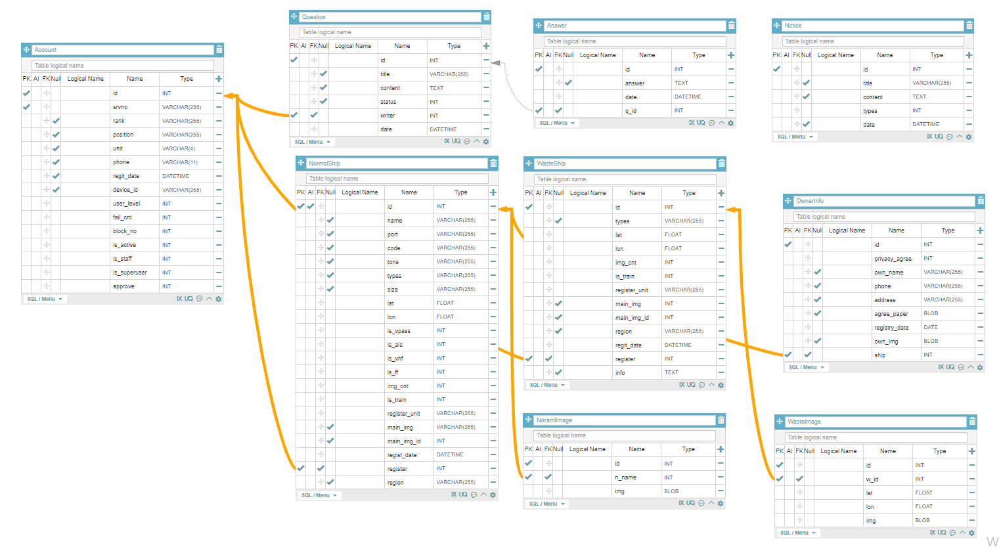

#  선박 확인 체계 서버 구현

## 1. 개발 목적
* 기존에 선박을 관리 방식은 문서화를 통해 매번 사진을 찍어 PC에 업로드 후 선박 정보를 작성하여 관리.
* 선박을 등록하고 수정하는 방식의 소요가 너무 크므로 어플을 통해 서버에서 선박을 관리하고 수정되는 방식을 채택하게 됨.
* 추가적으로 등록된 선박들 중 AI를 이용하여 선박을 식별하는 기능이 필요.

## 2. 개발 스택 및 도구
`Python` `Django` `django-restframework` `tensorflow` `postman` `NginX` `guniconr`

## 3. 맡은 역할
* 선박 및 유저 DB 모델 설계 및 구축
* REST API를 이용하여 선박 정보 등록, 수정, 삭제 등을 어플에서 할 수 있도록 작성.
* 선박 DB 에 등록되어 있는 선박 중 학습 데이터가 많은 선박 순으로 학습을 한 후 학습된 h5 파일을 이용하여 선박 예측 값을 어플로 보내주는 API 작성.

## 4. 모델 설계 및 작성
* ERD

> 테이블 상세 내용
> 1. Account
>   * 유저 정보 필드를 가지고 있는 테이블.
>   * 기존 django 에서 제공되는 AbstractBaseUser 모델을 상속 받아서 작성.
>   * 필요한 모델을 추가로 작성. ex) unit, rank, phone ...
>   * approve 라는 승인 필드를 만들어 승인되지 않으면 서버 로그인 불가능.
>   * user_level 을 통해 유저 별 권한이 존재.
>   * block_no 을 통해 로그인 실패 조건 충족 시 계정 잠금.
>   * fail_cnt 을 통해 로그인 실패 횟수 저장.
> 2. Question
>   * 1:1 문의를 위해 제목(title), 질문내용(content) 필드
>   * 답변 상태를 status 를 통해 표시
>   * date 필드를 통해 작성 날짜 저장, writer 필드를 통해 작성자 저장.
> 3. Answer
>   * Question에 대한 답변 필드를 1대1로 지정.
>   * date 필드를 통해 답변 날짜 작성.
> 4. Notice
>   * 공지사항에 대한 정보를 저장하는 테이블.
>   * 제목, 날짜, 공지사항 내용을 저장하는 필드
> 5. NormalShip
>   * 기본적인 선박 정보 필드를 가지는 테이블.
>   * 추가적으로 is_train 필드를 통해 학습이 되어있는 선박인지 확인 가능.
>   * 각종 장치 여부를 위한 필드 존재. (is_ff, is_ais, is_vpass, is_vhf)
>   * 해당 선박의 이미지 개수를 저장하는 img_cnt 필드
>   * main_img, main_img_id 필드를 이용하여 선박의 대표 이미지 경로 저장.
> 6. NormalImage
>   * NormalShip 을 외래키로 갖는 n_name 필드
>   * 해당 선박의 이미지를 저장할 img 필드
> 7. WasteShip
>   * 사용되지 않고 방치된 유기 선박들을 따로 관리하기 위한 테이블.
>   * 선박의 위치를 통해 식별하기 위해 lat, lon 필드 존재(위도, 경도)
>   * 유기 선박의 특징을 기록할 수 있는 info 필드 존재.
> 8. WasteImage
>   * WasteShip 을 외래키로 갖는 w_id 필드
>   * 유기 선박의 이미지를 저장할 img 필드
>   * 사진이 찍힌 위치를 저장할 lat, lon 필드
> 9. OwnerInfo
>   * NormalShip 을 외래키로 갖는 ship 필드
>   * 해당 선박의 선주 정보를 저장하는 테이블
>   * agreement_paper 필드에는 개인정보이용동의서를 저장
>   * own_img 필드는 선주 이미지를 저장

## 5. 필요한 모듈 개발
`best_three.py` [Code]()

`change_format.py` [Code]()

`check_pw.py` [Code]()

`custom_view.py` [Code]()

`prediction_ship.py` [Code]()

## 6. API 작성

### 1. Accounts
`LoginAPI`

`LogoutAPI`

`SignUpAPI`

`UserInfoAPI`

`UserPermissionAPI`

`VersionCheckAPI`

### 2. Post
`NoticeAPI`

`NoticeListAPI`

`QuestionAPI`

`QuestionAPI`

`QuestionListAPI`

`AnswerAPI`

### 3. Ships
`DetailNormalShipAPI, DetailWasteShipAPI`

`CreateNormalShipAPI, CreateWasteShipAPI`

## 7. 배포
* 클라우드 서버에 Django 프로젝트 업로드.
* `NginX` 와 `Gunicorn`을 이용하여 서버 배포